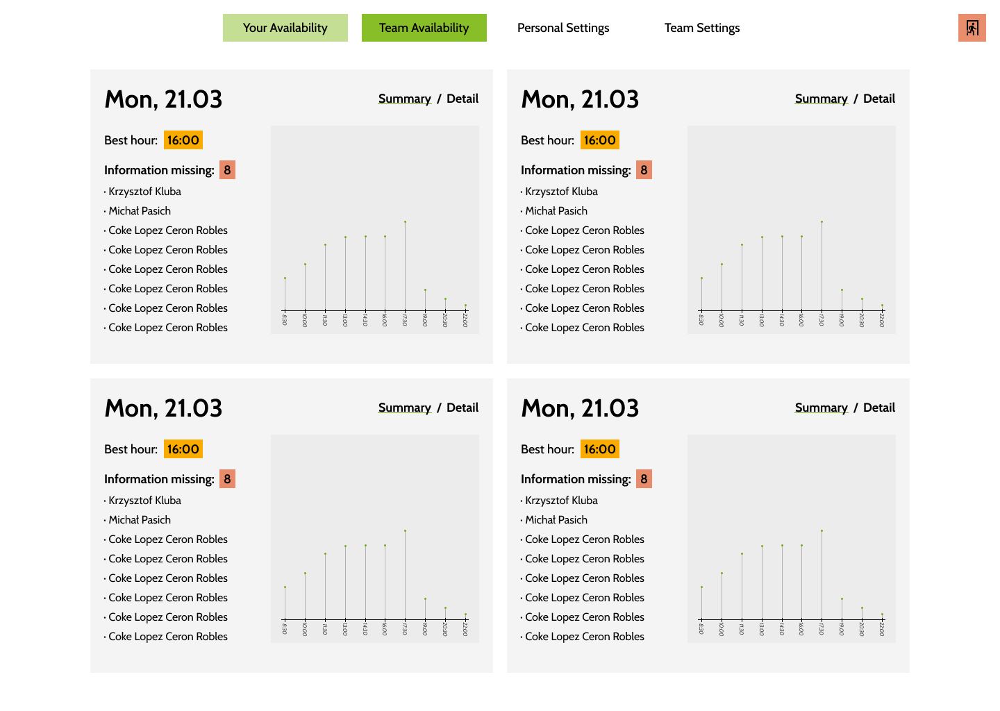
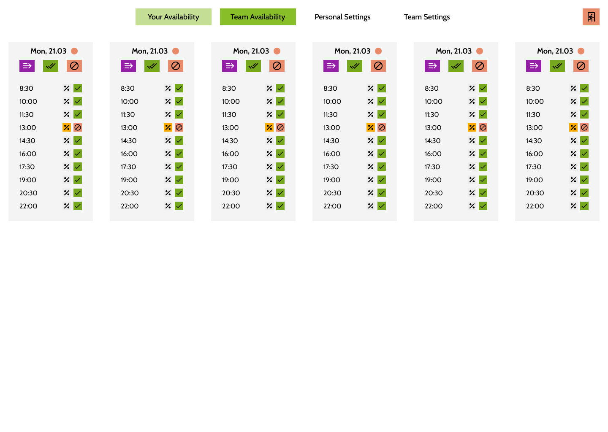

# `vacancy` - regular availability checking

> something better needs to be written in here

design: https://www.figma.com/file/db3VJOpRw01IxxqzDpLsnAaL/Vacancy-Frontend?node-id=1%3A3

exported version:

